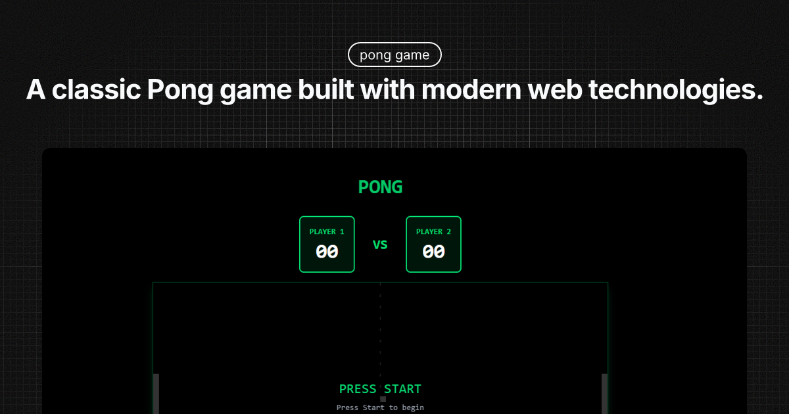

# 🏓 Pong Game

A classic Pong game built with modern web technologies.

## 🚀 Technologies Used

- **[Astro](https://astro.build/)** - Static site generator web framework
- **[TypeScript](https://www.typescriptlang.org/)** - Static typing for JavaScript
- **[Preact](https://preactjs.com/)** - Lightweight React alternative for game logic
- **[Tailwind CSS](https://tailwindcss.com/)** - Utility-first CSS framework for styling

## 🎮 Features

- Fully functional 2-player Pong game
- **Single-player mode with AI opponent**
- **Multiple AI difficulty levels (Easy, Medium, Hard)**
- Responsive keyboard controls
- Scoring system
- Realistic collision physics
- Modern interface with visual effects
- Modular, well-typed codebase

## 🎯 Controls

### Two Player Mode
- **Player 1**: 
    - `W` - Move paddle up
    - `S` - Move paddle down

- **Player 2**: 
    - `↑` - Move paddle up
    - `↓` - Move paddle down

### Single Player Mode (vs AI)
- **Player**: 
    - `W` - Move paddle up
    - `S` - Move paddle down
- **AI**: Automatically controls the right paddle

## 🛠️ Installation & Setup

1. Clone the repository:
```bash
git clone https://github.com/zkjon/pong.git
cd pong
```

2. Install dependencies:
```bash
bun install
```

3. Start the development server:
```bash
bun dev
```

4. Open your browser at `http://localhost:4321`

## 📦 Available Commands

| Command                   | Action                                           |
| :------------------------ | :----------------------------------------------- |
| `bun install`             | Install dependencies                            |
| `bun dev`                 | Start development server at `localhost:4321`    |
| `bun build`               | Build the site for production in `./dist/`      |
| `bun preview`             | Preview the local build                         |
| `bun astro ...`           | Run CLI commands like `astro add`, `astro check`|
| `bun astro -- --help`     | Get help using Astro CLI                        |


## 🎨 Technical Highlights

- **Modular architecture**: Clear separation between logic, types, and utilities
- **Strong typing**: TypeScript throughout for robustness
- **Custom hooks**: Efficient keyboard event handling
- **Canvas API**: Smooth, efficient game rendering
- **Responsive design**: Adapts to different screen sizes
- **Visual effects**: Modern animations and styles with Tailwind

## 🤝 Contributing

Contributions are welcome! Please:

1. Fork the project
2. Create a feature branch (`git checkout -b feature/AmazingFeature`)
3. Commit your changes (`git commit -m 'Add some AmazingFeature'`)
4. Push to your branch (`git push origin feature/AmazingFeature`)
5. Open a Pull Request

## 📝 License

This project is licensed under the MIT License. See the `LICENSE` file for details.

## 🎯 Upcoming Features

- [x] AI for single player mode
- [x] Multiple difficulty levels
- [ ] Sound effects
- [ ] Online multiplayer mode
- [ ] Different visual themes
- [ ] Achievement system

---

Enjoy playing Pong! 🏓

